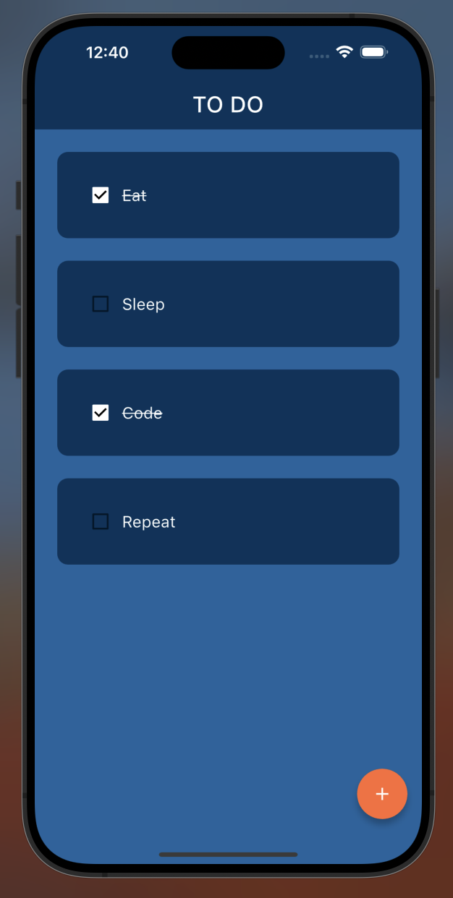
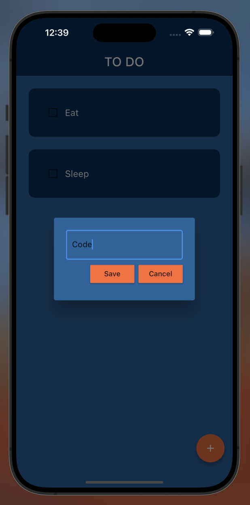
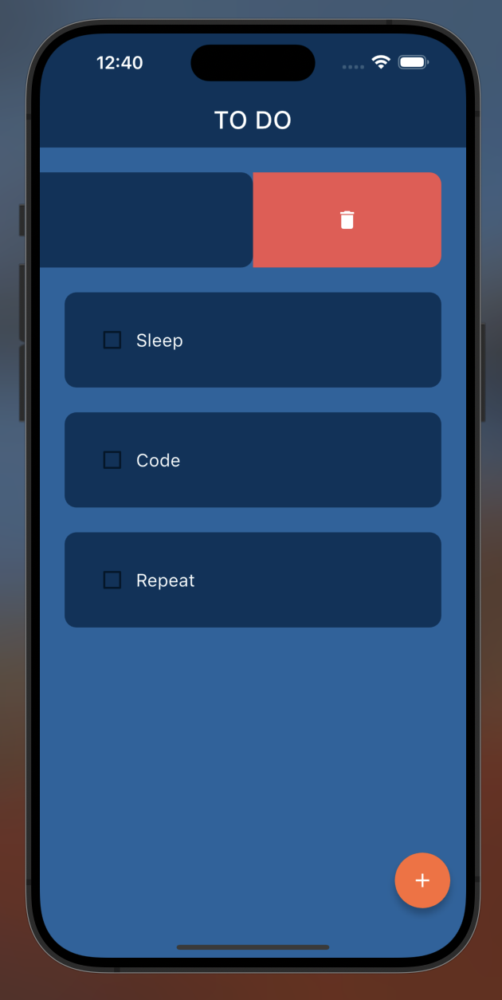

# ToDo App with Hive



This is a minimalistic Flutter Todo app that uses Hive for local storage.

## Technologies Used

- **Flutter**: A UI toolkit for building natively compiled applications for mobile, web, and desktop from a single codebase. [Learn more](https://flutter.dev/)
- **Hive**: A lightweight and blazing fast key-value store written in pure Dart. It is a great choice for local data storage in Flutter apps. [Learn more](https://pub.dev/packages/hive)

## Features

- Create, Read and Delete tasks.
- Local storage using Hive for data persistence.
- Simple and intuitive user interface.

## Screenshots





## Getting Started

1. Clone the repository:

```bash
git clone https://github.com/Harshdeepsingh0311/todo-app.git
